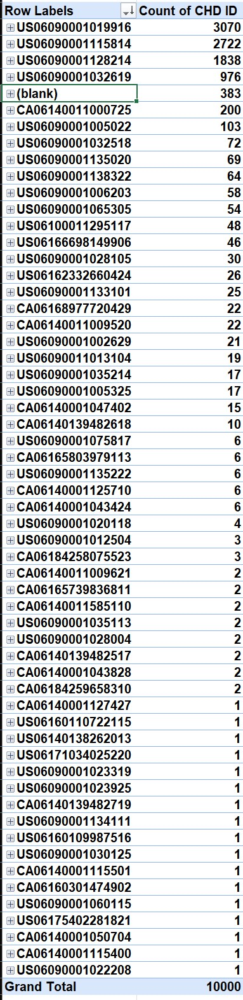
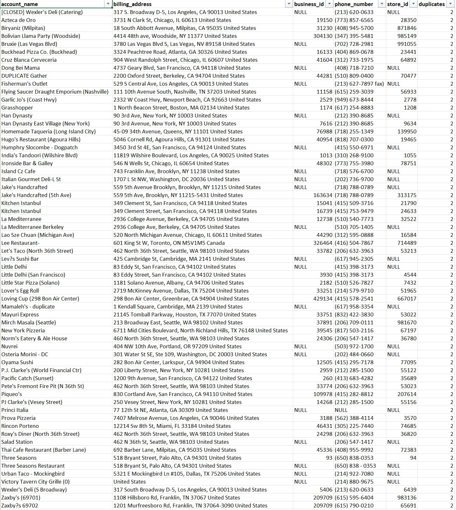

# Restaurants Analysis

Recommended next steps based on analysis for sample DD account data.

## Case Study 1

### Request, Triage, and Execution

Based on the business model and the nature of the speed at which it moves, to facilitate bulk changes and end user data requests, a chain of steps or flow should be established to provide faster and more accurate service to sales teams. This process would look more or less like:

- Sales teams identify objects on Salesforce that need change due to X reason.
- To reduce work done and backlogs, if changes are less than 10 overall, sales team should make the changes.
- Appropriate Salesforce training should be in lace for sales team to be able to modify portfolio data.
- Otherwise, a ticket should be placed requesting and specifying bulk changes.
- Request reaches Data Ops., which then proceeds to add to existing backlog of items based on priority.
- Changes are made externally, confirmed, uploaded through DataLoader, and checked once again.
- Sales team is adviced of changes and ticket is closed.

### Systems and Capabilities

Suggested systems and processes include:

- CRM for sales to record and manage relationship with portfolio/client data.
- Trained sales teams for self data validation and individual changes to customer data points.
- IT ticket system to record and manage requests of various kinds.
- Data Ops. team with enhanced access to multiple company data warehouses/lakes.
- Programs such as SQL, Excel, and Python for interaction with data.

### Metrics

Metrics measured for this process would include:

- Volume of requests
- Quality of data
- In place data validation
- Types of changes
- Objects changed

### Assumptions

- Access to data warehouses and data lakes is granted to Data Ops
- Sufficient systems are in place to handle volume of requests
- Data requests are accurate and based on bulk change needs
- Direct correlation exists between variables
- Quality of the data is unknown and errors are bound to exist
- Sample provided is representative of company overall data
- Outliers will be present and will add bias to the analysis if overlooked
- Data and observations will be related to one another

## Case Study 2

### Parent/Hierarchy Grouping

Hierarchy established: Corporate Entity (CHD PID) -> Franchise Owner (CHD Owner ID) -> Account Name (CHD ID)

With this hierarchy, a corporate entity always manages and oversees the activity of individual stores and individual stores owner by a franchise owner. Exceptions exist for accounts that have NULL values for corporate id.

Exceptions:

- 383 Accounts do not have CHD PID but have a Franchise Owner.

This can be approached by building a pivot table on Excel or Python, creating a dictionary object containing the parent id with respective groups and child data, or through a SQL query containing all accounts rows with respective parent id and franchise id columns.

### Duplicates

Using SQL, a query was performed to identify duplicate records based on the name of the account and its billing address. A total of 63 records were identified as duplicates in the dataset.

